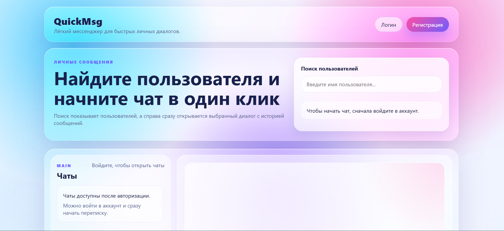
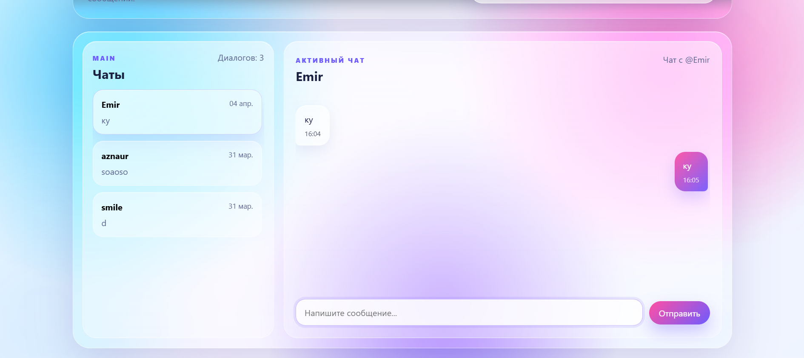
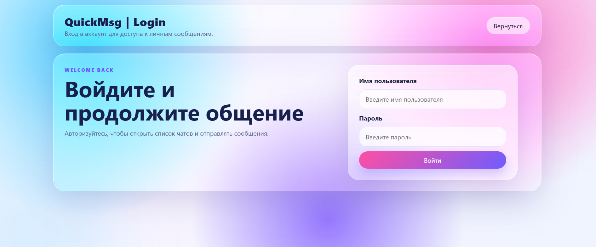

# QuickMsg 💬

**QuickMsg** — это веб-мессенджер с поддержкой общения в реальном времени. Проект реализован с использованием FastAPI и WebSocket, с упором на простоту, скорость и понятную архитектуру.

---

## 🚀 Основные возможности

* 🔐 Аутентификация пользователей через JWT
* 💬 Личные чаты (1 на 1)
* ⚡ Реальное время сообщений через WebSocket
* 🔍 Поиск пользователей
* 🗄️ Работа с базой данных PostgreSQL
* 🧪 Базовые тесты (авторизация)

---

## 🛠️ Технологии

* **Backend:** Python, FastAPI
* **Frontend:** HTML, CSS, JavaScript
* **Реальное время:** WebSocket
* **База данных:** PostgreSQL
* **ORM:** SQLAlchemy
* **Тестирование:** pytest

---

## 🧱 Архитектура проекта

Проект разделён на логические слои:

```
QuickMsg/
│── routers/        # API роуты (обработка запросов)
│── services/       # Бизнес-логика (auth, чаты, поиск)
│── models/         # ORM модели
│── templates/      # HTML шаблоны
│── static/         # CSS, JS
│── tests/          # Тесты
│── main.py         # Точка входа
```

### 📌 Как это работает

* **Routers** принимают запросы от клиента
* **Services** обрабатывают логику (например: логин, создание чата)
* **Models** описывают структуру базы данных
* **WebSocket слой** отвечает за отправку сообщений в реальном времени

### ⚡ WebSocket логика

* При подключении пользователь подписывается на чат
* Сообщения отправляются через WebSocket
* Сервер рассылает сообщения всем участникам чата

---

## 📸 Скриншоты





## ⚙️ Установка и запуск

### 1. Клонировать репозиторий

```bash
git clone https://github.com/your-username/quickmsg.git
cd quickmsg
```

### 2. Создать виртуальное окружение

```bash
python -m venv .venv
source .venv/bin/activate  # Windows: .venv\Scripts\activate
```

### 3. Установить зависимости

```bash
pip install -r requirements.txt
```

### 4. Настроить переменные окружения

Создайте файл `.env`:

```
DATABASE_URL=your_database_url
SECRET_KEY=your_secret_key
```

### 5. Запустить сервер

```bash
uvicorn main:app --reload
```

---

## 🧪 Тестирование

```bash
pytest
```

Пока покрыта только часть функционала (основной фокус — авторизация).

---

## 📌 Особенности реализации

* Собственная реализация WebSocket логики
* JWT-аутентификация
* Асинхронная работа с БД
* Разделение проекта на слои
* Реализован поиск пользователей

---

## 🔮 Планы по развитию

* Групповые чаты
* Уведомления
* Онлайн-статусы
* Улучшение UI/UX
* Полное покрытие тестами

---

## 👤 Автор

Pet-проект для практики backend-разработки и работы с WebSocket.

---
